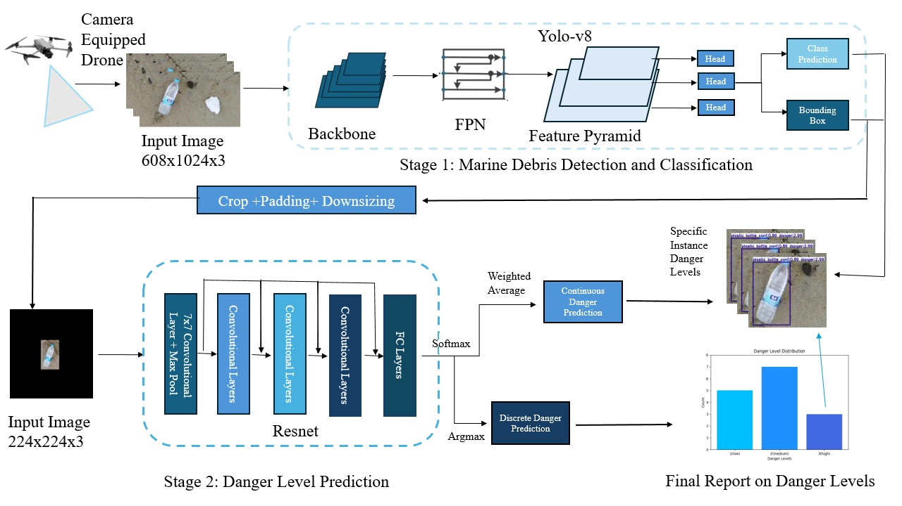

# Trash2Danger

__A Two Stage Deep Learning Based Pipeline for Marine Debris Danger Level Assessment__

## Overview

The Trash2Danger project presents a novel method for assessing the danger levels of marine debris using deep learning techniques. This two-stage model is comprised of an object detection model that classifies marine debris and a danger level prediction system that evaluates the ecological threat posed by each piece of debris. The goal of our model is to improve the efficiency of clean up efforts by allowing for more targeted intervention on areas of higher risk marine debris.


## Table of Contents

- [Getting Started](#getting-started)
- [Usage](#usage)
- [Model Architecture](#model-architecture)
- [Weights](#weights)
- [Dataset](#dataset)
- [Training](#training)
- [License](#license)
- [Examples](#examples)
- [Acknowledgments](#acknowledgments)

## Getting Started

To get started with this project, clone the repository and install the required dependencies. You can do this using the following commands:

```bash
git clone https://github.com/KrishManan/marine_debris_2.git
cd marine_debris_2
pip install -r requirements.txt
```

## Requirements
ultralytics

torch

torchvision

opencv-python

Other required libraries listed in requirements.txt

## Usage
Open the [src](src/) folder, where all the prediction and final analysis scripts are for the overall two stage model. 

[finalanalysis.py](src/finalanalysis.py) runs an overall analysis on a video using our pipeline, generating bar charts and reports at the end on class information

[finalpredict.py](src/finalpredict.py) runs the overall prediction of the two stage model on a single overall image

[finalpredictvideo.py](src/finalpredictvideo.py) runs the overall prediction of the two stage model on a video


## Model Architecture
The overall pipeline of Trash2Danger consists of a 2 stage model. One stage to output bounding boxes and class labels for identified debris, and another to output danger level predictions for identified debris. 



__Stage 1__
For the stage 1 model, any obect detection model will work, but we decided to use the yolov8n model in Trash2Danger, because of it's small size, fast inference time, and decent performance. Stage 1 training and running can be found in the [Yolo](Yolo/) folder. 

__Stage 2__
For the stage 2 model, we used the Resnet50 model. We trained our danger level prediction model to output danger levels on a scale from 1-3, where 1 is low danger, 2 is moderate danger, and 3 is high danger. Stage 2 training and running can be found in the 

## Weights
Pretrained weights are available in the [weights](weights/) folder for all the models that were tested.
The two resnet models for the stage 2, Resnet 18 and 50, as well as all the object detection stage 1 models are available with pretrained weights.

## Dataset
For stage 1 training, The dataset consists of images containing various types of marine debris, annotated with bounding boxes and marine debris classes. The dataset is split into training and validation sets, with annotations provided in a compatible format for the YOLO model. 

For stage 2 training, the individual bounding boxes that are annotated from the stage 1 dataset were cropped out, padded, and downsized. These were than labelled on danger level from 1-3.

## Dataset Sources
Most images taken and generated by ourselves from drone footage on Dapeng Bay, Shenzhen
Others from these open source datasets: https://universe.roboflow.com/reconhecimentoimgs/global-solution/browse?queryText=&pageSize=50&startingIndex=0&browseQuery=true,  https://universe.roboflow.com/gw-khadatkar-and-sv-wasule/trash-llsto 

## Training
To train your own model, create a stage 1 dataset of annotated images of marine debris in the yolo format. Then use the [cropper.py](Resnet/cropper.py) to create the stage 2 training set from the stage 1 dataset.

## Examples
Examples and testing images can be found in the [Examples](Examples/) folder and [Test](Examples/Test/) folder.

## License
This project is licensed under the MIT License - see the [LICENSE](LICENSE) file for details.

## Acknowledgments
YOLOv8 for object detection.

ResNet for image classification.

Feel free to contribute to the project, report issues, or suggest improvements!
